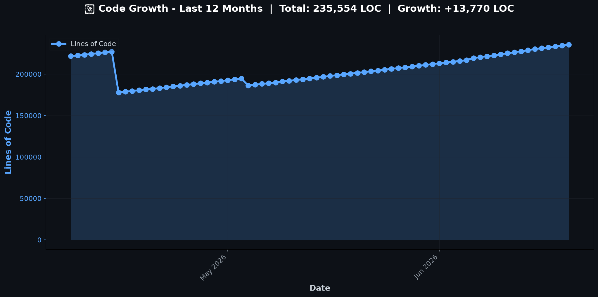

# 👋 Hi, I'm vkumar-dev

## 📊 Code Growth (Last 12 Months)

---

### 🚀 Autonomous Agents & AI Enthusiast

Welcome to my GitHub profile! I build tools and applications that make AI agents accessible to everyone.

---

## 📊 GitHub Stats

---

## 🌟 Featured Projects

### 🤖 AI Agent Tools & Orchestration

| Project | Description | Status |
|---------|-------------|--------|
| **[ralph-orchestrator](https://github.com/vkumar-dev/ralph-orchestrator)** | 🧠 Interactive CLI that distills requirements into PRDs, executes Ralph for autonomous development | ✨ Active |
| **[ralph-orchestrator-hub](https://github.com/vkumar-dev/ralph-orchestrator-hub)** | Central hub for Ralph orchestrator | ⚡ Latest |
| **[ralph-manager](https://github.com/vkumar-dev/ralph-manager)** | GUI & CLI for managing AI agent loops | ✨ Active |
| **[ralph-loop](https://github.com/vkumar-dev/ralph-loop)** | AI agent loop utilities | ✨ Active |
| **[fun-with-ralph-loops](https://github.com/vkumar-dev/fun-with-ralph-loops)** | Experimental Ralph loop projects | 🔬 Experiments |

### 🎨 Web Applications & Tools

| Project | Description | Status |
|---------|-------------|--------|
| **[vibe-coder](https://github.com/vkumar-dev/vibe-coder)** | AI-powered code generation | ✨ Active |
| **[probable-eureka](https://github.com/vkumar-dev/probable-eureka)** | An online local media player | ✨ Active |
| **[flowchartapp](https://github.com/vkumar-dev/flowchartapp)** | Flowchart visualization tool | ✨ Active |
| **[local-agent-shell](https://github.com/vkumar-dev/local-agent-shell)** | Browser-based terminal with local file/shell access | ✨ Active |

### 📝 Content & Automation

| Project | Description | Status |
|---------|-------------|--------|
| **[autonomousBLOG](https://github.com/vkumar-dev/autonomousBLOG)** | 🤖 Autonomous AI-powered blog generation (Fresh articles every 4 hours) | ⚡ Live |
| **[autonomousART](https://github.com/vkumar-dev/autonomousART)** | Autonomous AI art generation | ✨ Active |
| **[autonomousPLAYER](https://github.com/vkumar-dev/autonomousPLAYER)** | Shell scripts for automation | ✨ Active |

### 🧪 Experiments & More

| Project | Description | Status |
|---------|-------------|--------|
| **[247agent](https://github.com/vkumar-dev/247agent)** | 24/7 autonomous agent | 🔬 Experiments |
| **[SigmaOne](https://github.com/vkumar-dev/SigmaOne)** | Experimental project | 🔬 Experiments |
| **[Progress](https://github.com/vkumar-dev/Progress)** | Progress tracking tool | 🔬 Experiments |
| **[aicountdown](https://github.com/vkumar-dev/aicountdown)** | AI countdown timer | 🔬 Experiments |
| **[HelloWorld](https://github.com/vkumar-dev/HelloWorld)** | Hello World project | 📚 Learning |
| **[onlyzerosonce](https://github.com/vkumar-dev/onlyzerosonce)** | Config files for GitHub profile | ⚙️ Config |

---

## 🛠️ Technologies I Work With

  <code>🟨 JavaScript</code>
  <code>🟦 TypeScript</code>
  <code>🐍 Python</code>
  <code>⚛️ React</code>
  <code>🟢 Node.js</code>
  <code>🤖 AI/ML</code>
  <code>🐳 Docker</code>
  <code>☁️ GitHub Actions</code>

---

## 📈 Current Projects Status

- **Total Public Repos**: 16
- **Active Projects**: 8
- **Experimental**: 4
- **Configuration**: 1

Last Updated: February 2026

---

## 🌐 Live Demos

Experience my projects live:

- [autonomousBLOG](https://vkumar-dev.github.io/autonomousBLOG/) - AI-generated articles
- [vibe-coder](https://vkumar-dev.github.io/vibe-coder/) - Code generation
- [probable-eureka](https://vkumar-dev.github.io/probable-eureka/) - Media player
- [ralph-manager](https://vkumar-dev.github.io/ralph-manager/) - Agent management
- [flowchartapp](https://vkumar-dev.github.io/flowchartapp/) - Flowchart tool

---

## 🎯 What I'm Building

I focus on creating **autonomous AI systems** that work independently to:
- 🚀 Generate content autonomously
- 🤖 Manage complex workflows
- 💡 Reduce repetitive tasks
- 🔄 Enable continuous improvement loops

---

## 📫 Connect With Me

  

---

  Built with ❤️ and lots of ☕
   
  © 2026 vkumar-dev - All projects are open source and community-driven!

